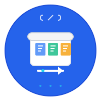

<div align="center">
  
  
  # FileCodeBox Go版本
  
  🚀 FileCodeBox的高性能Golang实现 - 开箱即用的文件快传系统
</div>

## ✨ 特性

- 🔥 **高性能** - Golang实现，并发处理能力强
- 📁 **文件分享** - 支持各种格式文件的快速分享
- 📝 **文本分享** - 支持文本内容的快速分享
- 🔧 **分片上传** - 支持大文件分片上传，断点续传
- ⚡ **断点续传** - 网络中断后可恢复上传，支持秒传
- ⏰ **灵活过期** - 支持时间和次数两种过期方式
- 🛡️ **安全可靠** - JWT认证、限流保护、权限控制
- 📊 **管理后台** - 完整的文件管理和系统配置
- 🗄️ **多存储** - 支持本地、WebDAV、S3存储
- 🐳 **容器化** - 开箱即用的Docker部署
- 🎨 **主题系统** - 支持多主题切换

## 快速开始

### 直接运行

```bash
# 安装依赖
go mod tidy

# 编译并运行
go build -o filecodebox
./filecodebox
```

服务启动后访问 `http://localhost:12345` 即可使用。

### Docker运行

```bash
# 构建镜像
docker build -t filecodebox-go .

# 运行容器
docker run -d -p 12345:12345 -v ./data:/root/data filecodebox-go
```

### Docker Compose

```bash
docker-compose up -d
```

### 多架构 Docker 构建

支持 ARM64 和 AMD64 架构的 Docker 镜像构建：

```bash
# 构建多架构镜像
./build-docker.sh

# 构建指定架构
./build-docker.sh --single linux/arm64
./build-docker.sh --single linux/amd64
```

## 配置

配置文件会自动生成在 `data/config.json`，主要配置项：

- `port`: 服务端口（默认12345）
- `name`: 站点名称
- `upload_size`: 最大上传大小
- `file_storage`: 存储类型（local/s3/webdav/onedrive）
- `admin_token`: 管理员访问令牌

## 管理员后台

### 访问方式
- 管理员页面：`http://localhost:12345/admin/`
- **默认密码**：`FileCodeBox2025`

### 主要功能
- 📊 **系统统计** - 查看文件数量、存储使用情况
- 📁 **文件管理** - 管理所有分享的文件
- ⚙️ **系统配置** - 配置站点信息、上传限制等
- 👥 **用户管理** - 启用用户系统、管理用户权限
- 💾 **存储配置** - 配置本地、S3、WebDAV等存储方式

### 初始配置建议
1. 首次启动后，立即访问管理员页面修改默认密码
2. 根据需要配置存储方式（本地存储/云存储）
3. 设置合适的上传大小限制
4. 配置站点名称和描述信息

## API接口

### 分享文本
```
POST /share/text/
```

### 分享文件
```
POST /share/file/
```

### 获取分享内容
```
GET /share/select/?code=xxx
POST /share/select/
```

### 分片上传和断点续传
```
POST /chunk/upload/init/          # 初始化分片上传
POST /chunk/upload/chunk/:upload_id/:chunk_index # 上传分片
POST /chunk/upload/complete/:upload_id            # 完成上传
GET  /chunk/upload/status/:upload_id              # 获取上传状态
POST /chunk/upload/verify/:upload_id/:chunk_index # 验证分片
DELETE /chunk/upload/cancel/:upload_id            # 取消上传
```

### 管理接口
```
GET /admin/stats         # 统计信息
GET /admin/files         # 文件列表
DELETE /admin/files/:id  # 删除文件
GET /admin/config        # 获取配置
PUT /admin/config        # 更新配置
```

## 项目结构

```
├── assets/                 # 项目资源文件
│   └── images/logos/       # Logo 和图标文件
├── docs/                   # 文档目录
│   ├── changelogs/         # 改动记录和版本日志
│   ├── design/             # 设计相关文档
│   └── *.md               # 其他文档
├── scripts/               # 脚本文件
│   ├── build-docker.sh    # Docker 构建
│   ├── deploy.sh          # 部署脚本
│   └── *.sh              # 其他脚本
├── main.go                # 主程序入口
├── internal/              # Go 源代码
│   ├── config/            # 配置管理
│   ├── database/          # 数据库初始化
│   ├── models/            # 数据模型
│   ├── services/          # 业务逻辑
│   ├── handlers/          # HTTP处理器
│   ├── middleware/        # 中间件
│   ├── storage/           # 存储接口
│   ├── routes/            # 路由设置
│   └── tasks/             # 后台任务
├── themes/                # 主题文件
│   └── 2024/              # 2024年主题
├── data/                  # 数据目录
├── tests/                 # 测试文件
└── docker-compose.yml     # Docker编排
```

## 与Python版本的差异

1. **性能提升**: Go版本具有更好的并发性能和更低的内存占用
2. **依赖更少**: 不需要Python运行时环境
3. **部署简单**: 编译后为单一可执行文件
4. **类型安全**: 静态类型系统减少运行时错误
5. **容器优化**: 支持多架构Docker镜像，更小的镜像体积

## 环境要求

### 开发环境
- Go 1.25+ 
- SQLite3（用于数据存储）
- Git（用于代码管理）

### 生产环境
- Linux/macOS/Windows
- 至少 512MB 内存
- 推荐使用 Docker 部署

## 部署建议

### Docker 部署（推荐）
```bash
# 使用 docker-compose（最简单）
docker-compose up -d

# 或手动运行 Docker
docker run -d \
  --name filecodebox \
  -p 12345:12345 \
  -v ./data:/root/data \
  --restart unless-stopped \
  filecodebox-go
```

### 直接部署
```bash
# 编译
go build -ldflags="-w -s" -o filecodebox

# 创建系统服务（可选）
sudo cp filecodebox /usr/local/bin/
sudo systemctl enable filecodebox
sudo systemctl start filecodebox
```

## 开发

### 添加新的存储后端

1. 实现 `storage.StorageInterface` 接口
2. 在 `storage.NewStorageManager` 中注册新存储
3. 在配置中添加相关配置项

### 添加新功能

1. 在 `models/` 中定义数据模型
2. 在 `services/` 中实现业务逻辑
3. 在 `handlers/` 中添加HTTP处理器
4. 在 `routes/` 中注册路由

## 安全建议

- 🔐 **修改默认密码**: 首次部署后立即修改管理员默认密码
- 🛡️ **使用HTTPS**: 生产环境建议配置SSL证书
- 🔥 **防火墙配置**: 只开放必要的端口（如12345）
- 📊 **定期备份**: 定期备份 `data` 目录
- 🚫 **访问控制**: 根据需要启用用户系统和权限控制

## 故障排除

### 常见问题

1. **端口被占用**
   ```bash
   # 检查端口占用
   lsof -ti:12345
   # 杀掉占用进程
   lsof -ti:12345 | xargs kill -9
   ```

2. **数据库锁定**
   ```bash
   # 重启服务即可解决
   pkill -f filecodebox
   ./filecodebox
   ```

3. **文件权限问题**
   ```bash
   # 确保data目录有正确权限
   chmod -R 755 data/
   ```

### 日志查看
```bash
# 查看应用日志
./filecodebox 2>&1 | tee app.log

# Docker 容器日志
docker logs filecodebox
```

## 许可证

MIT License
